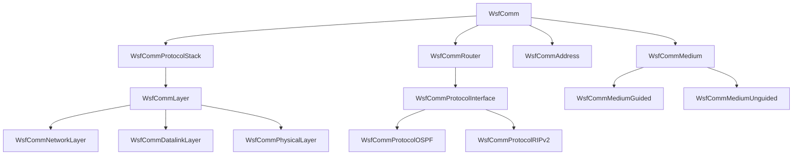

# AFSIM通信基础模型代码库分析

## 1、代码情况

### 代码组织结构
```
comm/
├── 核心通信类 (Core Communication)
├── 网络层实现 (Network Layer)
├── 协议栈实现 (Protocol Stack)
├── 路由器组件 (Router Components)
├── 传输介质 (Medium)
├── 消息处理 (Message Handling)
└── 工具类 (Utilities)
```

## 2、依赖关系

### 2.1 外部依赖

#### 工具库依赖（Ut前缀）

```
UtCallback.hpp        - 回调机制
UtCallbackHolder.hpp  - 回调容器
UtCloneablePtr.hpp    - 智能指针扩展
UtGraph.hpp           - 图算法库
UtInput.hpp           - 输入处理
UtScriptAccessible.hpp - 脚本接口
UtTable.hpp           - 表结构
```

#### 框架依赖（Wsf前缀）

```
WsfArticulatedPart.hpp - 部件基类
WsfAuxDataEnabled.hpp  - 辅助数据支持
WsfComponent.hpp       - 组件基类
WsfEvent.hpp          - 事件系统
WsfMessage.hpp        - 消息基类
WsfPlatform.hpp       - 平台支持
WsfRandomVariable.hpp - 随机变量
WsfScenario.hpp       - 场景管理
WsfSimulation.hpp     - 仿真引擎
```

### 2.2 内部模块依赖关系




## 3、模型架构

### 3.1 OSI七层模型实现

该代码库实现了完整的OSI七层网络模型：

1. **物理层 (Physical Layer)**

    - `WsfCommPhysicalLayer.hpp/cpp`
    - 处理信号传输和硬件接口

2. **数据链路层 (Data Link Layer)**

    - `WsfCommDatalinkLayer.hpp/cpp`
    - 负责帧处理和错误检测

3. **网络层 (Network Layer)**

    - `WsfCommNetworkLayer.hpp/cpp`
    - 处理路由和寻址

4. **传输层 (Transport Layer)**

    - `WsfCommTransportLayer.hpp/cpp`
    - 提供端到端的可靠传输

5. **会话层 (Session Layer)**

    - `WsfCommSessionLayer.hpp/cpp`
    - 管理会话建立和维护

6. **表示层 (Presentation Layer)**

    - `WsfCommPresentationLayer.hpp/cpp`
    - 数据格式转换和加密

7. **应用层 (Application Layer)**

    - `WsfCommApplicationLayer.hpp/cpp`
    - 提供应用程序接口

### 3.2 核心组件

#### 3.2.1 WsfComm类（主通信类）
```cpp
class Comm : public WsfArticulatedPart
{
    // 通信类型定义
    enum CommType {
        cCT_XMT_ONLY,  // 仅发送
        cCT_RCV_ONLY,  // 仅接收
        cCT_XMT_RCV    // 收发双向
    };
    
    // 多播支持级别
    enum class MulticastConformanceLevel {
        cLEVEL_0,  // 不支持多播
        cLEVEL_1,  // 仅支持发送
        cLEVEL_2   // 完全支持
    };
};
```

**主要功能**：
- 管理通信设备的基本属性（地址、网络归属）
- 处理消息的发送和接收
- 支持组件化架构
- 集成路由器功能

#### 3.2.2 协议栈管理（ProtocolStack）
```cpp
class ProtocolStack {
    // 层级管理
    Layer* AddLayer(std::unique_ptr<Layer> aLayerPtr);
    bool RemoveLayer(size_t aLayerIndex);
    Layer* InsertLayer(size_t aLayerIndex, std::unique_ptr<Layer> aLayerPtr);
    
    // 消息处理
    virtual bool Receive(double aSimTime, Comm* aXmtrPtr, Message& aMessage);
    virtual bool Send(double aSimTime, Message& aMessage);
};
```

**特点**：
- 动态层级管理
- 支持运行时协议栈修改
- 层间消息传递机制

## 4、网络拓扑支持

### 4.1 支持的网络拓扑类型

1. **点对点网络 (Point-to-Point)**

    - `WsfCommNetworkPointToPoint.hpp/cpp`
    - 两个节点直接连接

2. **网状网络 (Mesh)**

    - `WsfCommNetworkMesh.hpp/cpp`
    - 全连接或部分连接拓扑

3. **星型网络 (Star)**

    - `WsfCommNetworkStar.hpp/cpp`
    - 中心节点与多个外围节点

4. **环形网络 (Ring)**

    - `WsfCommNetworkRing.hpp/cpp`
    - 节点串联成环

5. **Ad-Hoc网络**

    - `WsfCommNetworkAdHoc.hpp/cpp`
    - 动态自组织网络
    - 支持运行时拓扑变化

6. **通用网络 (Generic)**

    - `WsfCommNetworkGeneric.hpp/cpp`
    - 灵活的网络配置

### 4.2 网络管理器（NetworkManager）

```cpp
class NetworkManager : public WsfSimulationExtension {
    // 网络拓扑类型
    enum class NetworkTopology {
        cPOINT_TO_POINT,
        cMESH,
        cSTAR,
        cRING,
        cDIRECTED_RING
    };
    
    // 核心功能
    - 管理所有通信设备地址映射
    - 维护网络拓扑图
    - 支持多播组管理
    - 提供路径查询功能
};
```

## 5、路由协议实现

### 5.1 支持的路由协议

1. **OSPF (Open Shortest Path First)**

    - `WsfCommProtocolOSPF.hpp/cpp`
    - 链路状态路由协议
    - 支持区域划分
    - DR/BDR选举机制
    - 约2000行实现代码

2. **RIPv2 (Routing Information Protocol v2)**

    - `WsfCommProtocolRIPv2.hpp/cpp`
    - 距离向量路由协议
    - 周期性路由更新

3. **IGMP (Internet Group Management Protocol)**

    - `WsfCommProtocolIGMP.hpp/cpp`
    - 多播组管理协议
    - 支持组成员管理

4. **Legacy协议**

    - `WsfCommProtocolLegacy.hpp/cpp`
    - 传统路由实现

5. **Ad-Hoc路由**

    - `WsfCommProtocolAdHoc.hpp/cpp`
    - 自组织网络路由

### 5.2 路由器架构

```cpp
class Router : public WsfPlatformPart {
    // 发送数据封装
    class SendData {
        Comm* GetXmtr();
        std::vector<Message>& GetMessages();
    };
    
    // 核心路由方法
    virtual bool Receive(...);
    virtual bool Send(...);
    
    // 协议管理
    ComponentList& GetComponents();
};
```

## 6、传输介质支持

### 6.1 介质类型

1. **有线介质 (Guided Medium)**

    - `WsfCommMediumGuided.hpp/cpp`
    - 支持点对点连接
    - 确定性传输特性

2. **无线介质 (Unguided Medium)**

    - `WsfCommMediumUnguided.hpp/cpp`
    - 广播特性
    - 支持电磁传播模型

3. **无线电收发器**

    - `WsfRadioXmtrRcvr.hpp/cpp`
    - 专门的无线电通信支持

### 6.2 介质管理

```cpp
class MediumContainer {
    // 介质容器管理
    - 支持多种介质类型
    - 动态介质配置
    - 消息状态跟踪
};
```

## 7、消息处理机制

### 7.1 消息结构

```cpp
class Message : public UtScriptAccessible, public WsfAuxDataEnabled {
    // 核心组成
    - 源消息指针 (mSrcMessagePtr)
    - 消息头栈 (mHeaders)
    - 消息尾栈 (mTrailers)
    - 路由追踪 (mTraceRoute)
    - TTL控制 (mTTL)
    - 传输特性 (mTransportFeature)
    
    // 消息标识符
    class Identifier {
        unsigned int GetSerialNumber();
        const Address& GetSource();
        const Address& GetDestination();
    };
};
```

### 7.2 层间消息传递

```cpp
namespace layer {
    class Message {
        // 层间控制消息
        static constexpr Message cDOWN_ACK_SEND;
        static constexpr Message cDOWN_NACK_SEND;
        static constexpr Message cUP_ACK_RECEIVE;
        static constexpr Message cNETWORK_FORWARD;
        static constexpr Message cDATALINK_READY;
    };
}
```

## 8、地址管理

### 地址类（WsfCommAddress）
- 支持多种地址格式
- 层次化地址结构
- 子网掩码支持
- 地址转换功能

### 保留地址管理
```cpp
class ReservedAddressing {
    // 管理特殊用途地址
    - 广播地址
    - 多播地址范围
    - 本地地址
};
```


## 9、设计模式

### 组件模式（Component Pattern）

```cpp
// 所有组件的基类接口
class WsfComponent {
    virtual WsfComponent* CloneComponent() const = 0;
    virtual const int* GetComponentRoles() const = 0;
    virtual void* QueryInterface(int aRole) = 0;
    virtual int GetComponentInitializationOrder() const = 0;
};
```

**应用实例**：

- WsfComm
- WsfCommRouter
- 所有Protocol类

### 策略模式（Strategy Pattern）

```cpp
// 路由策略接口
class ProtocolInterface {
    virtual bool Send(double aSimTime, Router::SendData& aData) = 0;
    virtual bool Receive(...) = 0;
    virtual std::vector<Address> Routing(...) = 0;
};

// 具体策略实现
class ProtocolOSPF : public ProtocolInterface { ... }
class ProtocolRIPv2 : public ProtocolInterface { ... }
```

### 装饰器模式（Decorator Pattern）

```cpp
// 消息装饰
class Message {
    void PushHeader(MessageHeader* aHeader);
    void PushTrailer(MessageTrailer* aTrailer);
    MessageHeader* PopHeader();
    MessageTrailer* PopTrailer();
};
```

### 观察者模式（Observer Pattern）

```cpp
// 事件通知机制
class Event : public WsfEvent {
    virtual void Execute(WsfSimulation& aSim) = 0;
};

// 回调注册
UtCallbackHolder mCallbacks;
```

## 10、关键算法

### 10.1 路由算法

#### Dijkstra最短路径算法

位置：`WsfCommGraph.cpp`

```cpp
// 使用优先队列实现的Dijkstra算法
void Graph::ComputeShortestPaths(const Address& aSource) {
    // 初始化距离表
    // 优先队列处理
    // 更新邻接节点
}
```

#### OSPF链路状态算法

- DR/BDR选举算法
- LSA泛洪算法
- SPF树计算

### 10.2 地址管理算法

#### 子网掩码计算

```cpp
class Address {
    bool IsInSubnet(const Address& aSubnet, const Address& aMask);
    Address GetNetworkAddress(const Address& aMask);
    Address GetBroadcastAddress(const Address& aMask);
};
```

### 10.3 队列管理算法

```cpp
class Queue {
    // FIFO队列
    // 优先级队列
    // 带宽控制
    // 拥塞控制
};
```

## 11、性能优化

### 11.1 内存管理

1. **智能指针使用**

  ```cpp
  std::unique_ptr<Layer> mLayer;
  std::shared_ptr<OSPF_Area> mArea;
  ut::CloneablePtr<WsfMessage> mMessage;
  ```

2. **对象池技术**

    - 消息对象复用
    - 事件对象池

3. **移动语义**

```cpp
Message(Message&&) = default;
Message& operator=(Message&&) = default;
```

### 11.2 算法优化

1. **哈希表应用**

  ```cpp
  std::unordered_map<Address, Comm*> mCommMap;
  std::unordered_set<Address> mAddressSet;
  ```

2. **缓存机制**

    - 路由表缓存
    - 地址解析缓存

3. **延迟计算**

    - 按需更新路由表
    - 事件驱动的状态更新

## 12、线程安全性

### 12.1 潜在并发点

1. **多平台仿真**

    - 不同平台的通信设备可能并行执行
    - 需要同步的共享资源：
        - NetworkManager
        - 全局路由表
        - 多播组成员表

2. **事件调度**

    - 并发事件处理
    - 事件队列访问

### 12.2 同步机制

目前代码未见显式的互斥锁或同步原语，可能采用：

- 单线程事件循环
- 时间步进同步
- 仿真引擎层面的同步

## 13、扩展考虑

### 13.1 协议扩展点

```cpp
// 新协议实现步骤
1. 继承 ProtocolInterface
2. 实现必需的虚函数
3. 注册到 ProtocolFactory
4. 配置输入解析
```

### 13.2 网络类型扩展

```cpp
// 新网络拓扑实现
1. 继承 Network 基类
2. 实现拓扑管理逻辑
3. 注册到 NetworkManager
4. 实现特定的连接规则
```

### 13.3 介质类型扩展

```cpp
// 新传输介质
1. 继承 Medium 基类
2. 实现传输特性
3. 注册到 MediumFactory
4. 定义传播模型
```

## 14、配置与脚本接口

### 14.1 脚本类注册

```cpp
const char* GetScriptClassName() const override { 
    return "WsfCommProtocolOSPF"; 
}
```

### 14.2 输入处理

```cpp
bool ProcessInput(UtInput& aInput) override {
    // 解析配置参数
    // 设置运行时属性
    // 验证输入合法性
}
```

## 15、测试与调试

### 15.1 调试功能

1. **消息追踪**

  ```cpp
  std::vector<Address>& GetTraceRoute() { return mTraceRoute; }
  ```

2. **状态查询**

  ```cpp
  bool IsOperational() const;
  bool CanSend() const;
  bool CanReceive() const;
  ```

3. **统计信息**

    - 消息计数
    - 路由跳数
    - 延迟统计

### 15.2 测试点

- 事件注入
- 故障模拟
- 性能度量点


