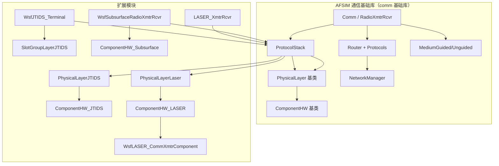
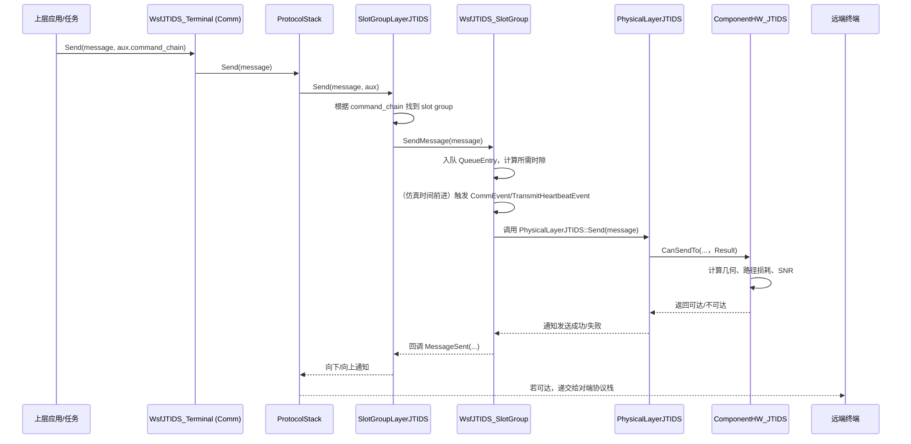
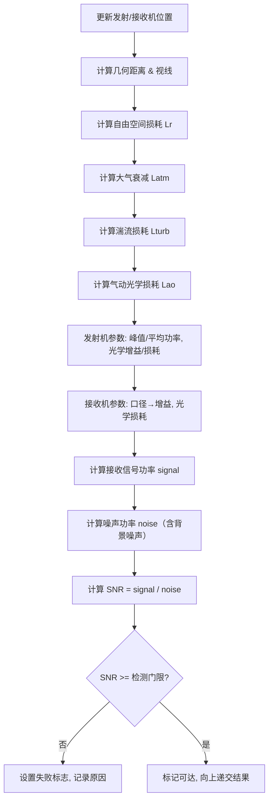
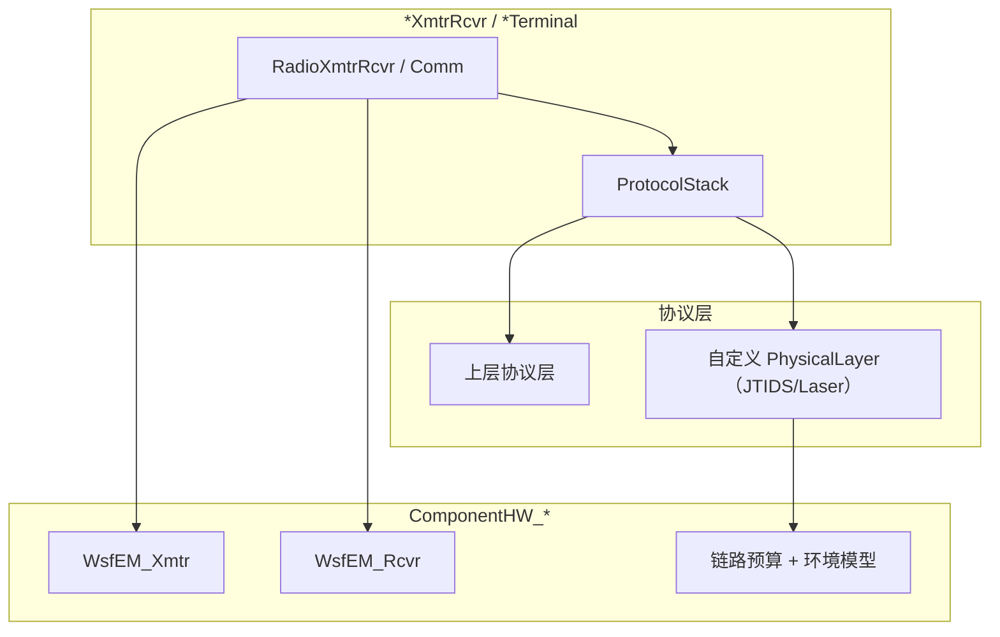

# AFSIM通信扩展模型（wsf_mil/comm）


## 1. 代码情况

### 1.1 模块划分

wsf_mil/comm 目录下主要包含三个通信模型：

1. **JTIDS / Link-16 类 TDMA 数据链模型**

    - 时隙组（slot group）为核心抽象，建模网络容量与调度；
    - 支持多网络、多 slot group、slot packing、pair relay、time-slot reuse 等；
    - 负责“物理传输能力”，不显式建模 J-series 消息。

2. **激光通信（Laser Comms）模型**

    - 面向光通信链路：调制（OOK/PPM/DPSK）、链路预算、大气/湍流/气动光学损失；
    - 提供详细 link budget 打印能力，用于调试与标定。

3. **水下 / 潜艇无线电（Subsurface Radio）模型**

    - 面向海水传播场景，支持水下路径分解/水衰减/最大通信深度；
    - 提供 VLF 特殊模式与“自定义地平线角”判定。

### 1.2 主要文件列表

**JTIDS / Slot Group 模块**

- `WsfJTIDS_Terminal.{hpp,cpp}`  
- `WsfJTIDS_SlotGroup.{hpp,cpp}`  
- `WsfCommSlotGroupLayerJTIDS.{hpp,cpp}`  
- `WsfCommPhysicalLayerJTIDS.{hpp,cpp}`  
- `WsfCommComponentHW_JTIDS.{hpp,cpp}`  

**激光通信模块**

- `WsfLASER_XmtrRcvr.{hpp,cpp}`  
- `WsfLASER_CommXmtrComponent.{hpp,cpp}`  
- `WsfCommPhysicalLayerLaser.{hpp,cpp}`  
- `WsfCommComponentHW_LASER.{hpp,cpp}`  

**水下通信模块**

- `WsfSubsurfaceRadioXmtrRcvr.{hpp,cpp}`  
- `WsfCommComponentHW_Subsurface.{hpp,cpp}`  

### 1.3 扩展模块列表

1. **JTIDS / Link-16 Slot Group 通信模型**

    - 面向战术数据链（类似 Link-16）的时分多址网络容量建模。
2. **激光通信（Laser Comms）模型**

    - 面向自由空间光通信的链路预算与调制建模。
3. **水下 / 潜艇无线电（Subsurface Radio）模型**

    - 面向海水传播场景的无线电通信扩展。

### 1.4 与基础库的关系

扩展模块与基础库的关系如下图所示：



可以看到：

- 扩展模块 **不替换上层（Network/Transport 等）逻辑**；
- 扩展主要发生在：
  
    - 终端类型（Comm 子类）；
    - 物理层（PhysicalLayer）；
    - 硬件组件（ComponentHW）；
    - 少量协议层（如 JTIDS 的 SlotGroupLayer）。

## 2. JTIDS / Link-16 Slot Group 通信模型

### 2.1 设计目标

- 为战术数据链（JTIDS/Link-16）提供：
  - **时隙结构**（Frame/Set/Slot）；
  - **网络容量与队列管理**；
  - 基本中继与打包行为（paired slot relays、time-slot reuse 等）。
- 该模型本质上是对 **物理层与部分数据链路层行为** 的扩展：
  - `PhysicalLayerJTIDS` 负责物理可达性；
  - `WsfJTIDS_SlotGroup` + `SlotGroupLayerJTIDS` 负责帧/时隙调度；
  - 上层（Network/Transport/Router）仍使用基础库逻辑。

### 2.2 核心类与功能

#### 2.2.1 `WsfJTIDS_Terminal`（Comm 子类）

- 继承：`wsf::comm::Comm`
- 在构造时：
  - 配置协议栈，引入 `SlotGroupLayerJTIDS`；
  - 将最底层物理层替换为 `PhysicalLayerJTIDS`；
  - 将硬件组件替换为 `ComponentHW_JTIDS`。
- 与基础库交互：
  - 依旧通过 NetworkManager 查找目标终端；
  - 上层路由/会话逻辑不变。

#### 2.2.2 `SlotGroupLayerJTIDS` 与 `WsfJTIDS_SlotGroup`

与基础库的关系：

- `SlotGroupLayerJTIDS` 作为协议栈中的“逻辑 MAC 层”：
  - 位于 PhysicalLayer 上方，NetworkLayer 下方；
  - 将上层数据（Message）分发给不同 `WsfJTIDS_SlotGroup`；
  - 管理全局时隙参数（frames/sets/slots/slot_size）。
- `WsfJTIDS_SlotGroup` 记录：
  - 所属网络号（配合 NetworkManager）；
  - 打包格式/打包数量；
  - Time Slot Blocks；
  - 队列与事件调度（基于 `WsfEvent`）。

#### 2.2.3 `PhysicalLayerJTIDS` 与 `ComponentHW_JTIDS`

在基础库层面的补充：

- `PhysicalLayerJTIDS` 继承自基础库 `PhysicalLayer`，因此：
  - 与协议栈其它层的接口完全一致；
  - 只需重写 `Send/Receive` 的链路判定调用。
- `ComponentHW_JTIDS` 继承 `ComponentHW`：
  - 与 `WsfEM_Xmtr/EM_Rcvr` 深度集成；
  - 完成 JTIDS 专用的 RF 链路预算；
  - 通过 `Result` 对象与基础库的 Medium/Message 交互。

### 2.3 与基础库网络/路由的关系

- JTIDS 模型 **不改变** NetworkManager/Router 的工作方式；
- 不做 IP 级路由，更多是 **在物理/链路层实现“广播+调度”** 的抽象；
- 如果上层仍使用 OSPF/RIP 等协议，则可以在 JTIDS 通道上“承载 IP 报文”。

### 2.4 Slot Group 配置项

在 `WsfJTIDS_SlotGroup::ProcessInput` 中支持的主要指令如下。

#### 2.4.1 slot group 级配置

```text
slot_group <name>
{
    network <0..127>
    per_unit_slots_per_frame <int>
    receive_only
    tsec <0..127>
    msec <0..127>
    queue_limit <int>
    packing_limit <int>
    packing_format <std | p2sp | p2dp | p4sp>
    time_slot_block <set>-<index>-<rrn>
    ...
}
```

配置说明示例表：

| 指令                       | 含义                                                         | 备注                       |
| -------------------------- | ------------------------------------------------------------ | -------------------------- |
| `network`                  | JTIDS 网络号（0–127）                                        | 必填                       |
| `per_unit_slots_per_frame` | 每终端每帧可用时隙数                                         | 为 0 表示不可发送          |
| `receive_only`             | 将 `per_unit_slots_per_frame` 置为 0，终端仅接收             |                            |
| `tsec` / `msec`            | 加密相关参数（0–127），用于区分密钥/时隙加密设置             |                            |
| `queue_limit`              | 队列长度上限，内部会 +1 预留正在发射中的消息                 |                            |
| `packing_limit`            | 单 slot group 中可打包的最大消息数                           |                            |
| `packing_format`           | 时隙打包格式（标准/2/4 包）                                  | `std`/`p2sp`/`p2dp`/`p4sp` |
| `time_slot_block`          | 设置 Time Slot Block（`<set>-<index>-<rrn>`）定义 offset/interval | 可配置多个                 |

#### 2.4.2 协议层（SlotGroupLayerJTIDS）级配置

在 `SlotGroupLayerJTIDS::ProcessInput` 中处理：

```text
frames_per_second <double>
sets_per_frame <int>
slots_per_set <int>
slot_size <bits_per_slot>
slot_group <name> { ... }  // 见上
command_chain <cmdChainName> slot_group <groupName>
```

配置说明表：

| 指令                | 含义                                      |
| ------------------- | ----------------------------------------- |
| `frames_per_second` | 每秒的帧数                                |
| `sets_per_frame`    | 每帧包含的 slot set 数                    |
| `slots_per_set`     | 每个 set 中的 slot 数（→ 总 slots/frame） |
| `slot_size`         | 标准 packing 时单 slot 可承载 bit 数      |
| `slot_group`        | 定义/配置一个 slot group 区块             |
| `command_chain`     | 将上层 command chain 映射到 slot group    |

------

### 2.5 JTIDS 收发时序示意

以下为简化的发送流程时序（省略部分底层细节）：




### 2.6 扩展考虑

1. **新增 JTIDS 特性**
   - 新的接入方式（contention access、time slot reallocation 等）主要在 `WsfJTIDS_SlotGroup` 与 `SlotGroupLayerJTIDS` 中实现；
   - 设计上已预留 `TimeSlotBlock`、packing 等结构，可以利用这些抽象扩展。
2. **改变链路覆盖与性能**
   - 可在 `ComponentHW_JTIDS` 中修改：
     - 频率、带宽；
     - 检测门限；
     - 最大通信距离 `mMaximumRange`；
   - 复杂干扰/电子战可通过拓展 `AttemptToTransmit/Receive` 的前后逻辑实现。
3. **迁移到自研平台时的重用**
   - JTIDS 模块的时隙/队列/调度逻辑是通用的；
   - 只需替换底层 EM/几何接口，即可在新平台中复用 slot group 层与大部分配置语法。

## 3. 激光通信（Laser Comms）模型

### 3.1 设计目标

利用基础库提供的：
- `RadioXmtrRcvr` + `WsfEM_Xmtr/EM_Rcvr`；
- `ProtocolStack` 可插拔的物理层；
- `ComponentHW` 组件机制；

实现了

- 建模自由空间光通信（air/space-to-space、air-to-ground 等）的链路能力；
- 支持多种调制（OOK / PPM / DPSK）与不同参数组合；
- 综合考虑：

  - 自由空间路径损耗；
  - 大气衰减（attenuation）；
  - 湍流（turbulence）；
  - 气动光学（aero-optic）；
  - 背景辐射（background radiance/irradiance）；

- 提供可读性较强的 link budget 输出，便于调试与验证。

### 3.2 `LASER_XmtrRcvr` 

- `LASER_XmtrRcvr` 继承 `RadioXmtrRcvr`；
- 构造过程：
  1. 调用基类构造，建立基础协议栈与 ComponentHW；
  2. 删除所有基础物理层 `PhysicalLayer`（来自基础库）；
  3. 在栈底插入 `PhysicalLayerLaser`；
  4. 删除默认 ComponentHW，创建 `ComponentHW_LASER`；
- 通过这个模式，实现了“基于基础库骨架，自定义物理+硬件”。

### 3.3 `PhysicalLayerLaser` 与 `WsfLASER_CommXmtrComponent`

**PhysicalLayerLaser：**

- 继承基础库 `PhysicalLayer`；
- 在 `Initialize` 中：
  - 通过 `ComponentHW` 找到 `WsfEM_Xmtr`；
  - 再找到挂在发射机上的 `WsfLASER_CommXmtrComponent` 组件；
- 将其数据率透传为物理层吞吐率（`GetTransferRate()`）。

**WsfLASER_CommXmtrComponent：**

- 继承 `WsfComponent`；
- 与 `WsfEM_Xmtr` 基类紧耦合；
- 提供：
  - 基于调制参数（PRF、脉宽、PPM 阶数等）的数据率/占空比计算；
  - 指向误差的传输因子；
- 通过基础库的组件接口：
  - 可被脚本配置（`ProcessInput`）；
  - 可通过脚本/GUI 查询其状态。

内部子类 `Modulation`：

- 枚举类型 `Type`：
  - `cUNDEFINED`, `cOOK`, `cPPM`, `cDPSK`；
- 关键参数：
  - `double mSlotDuration;`（slot 宽度/时隙时长）；
  - `double mDataRate;`（bit/s）；
  - `double mDutyCycle;`；
  - `unsigned mPPM_Order;`（PPM 阶数：2/4/8/...）。

**配置指令（部分）：**

| 指令                          | 含义                            |
| ----------------------------- | ------------------------------- |
| `modulation_type`             | `ook` / `ppm` / `dpsk`          |
| `ppm_order`                   | PPM 调制阶数                    |
| `slot_width`                  | 时隙宽度（时间单位）            |
| （其它与脉宽/PRF 等相关参数） | 用于推导 data rate & duty_cycle |

**初始化逻辑：**

- 在 `Initialize(WsfEM_Xmtr& aXmtr)` 中：
  - 与发射机的 `pulse_width`、`pulse_repetition_frequency` 等参数做一致性校核；
  - 计算数据率与占空比：
    - PPM：`mDutyCycle = 1.0 / mPPM_Order`，再由 PRF/slot 宽度推导数据率；
    - OOK/DPSK：从脉冲宽度/PRF 中推导 slotDuration 与数据率；
  - 必要参数缺失时通过日志报错。

### 3.4 `ComponentHW_LASER` 与 link budget

作为 `ComponentHW` 子类，完全复用基础库的：
- EM 几何/遮挡检查；
- `Result` 结构、噪声/信号表示；
- 回调/统计机制；

在此基础上进行激光链路预算；

  - 组合考虑：
    - 几何/路径长度；
    - 自由空间损耗；
    - 大气衰减（attenuation）；
    - 湍流（turbulence）；
    - 气动光学（aero-optic）；
    - 天线/光学增益、指向损失（pointing loss）；
    - 背景噪声（radiance/irradiance）；
  - 在调试模式下输出完整 link budget。

**关键成员：**

- `mTurbulence`：湍流模型；
- `mTurbulenceTransmissionFactor`：湍流透过率（默认 0：采用模型）；
- `mAttenuationTransmissionFactor`：大气衰减透过率；
- `mAeroOpticTransmissionFactor`：气动光学透过率；
- `mBackgroundSpectralRadiance` / `mBackgroundSpectralIrradiance`；
- `mShowLinkBudget`：是否打印链路预算。

**配置指令示例：**

| 指令                                                   | 含义                                      |
| ------------------------------------------------------ | ----------------------------------------- |
| `attenuation`                                          | 媒介衰减（转给 `mXmtrPtr->ProcessInput`） |
| `aero_optic_transmission_factor` / `aero_optic_loss`   | 气动光学透过率/损耗                       |
| `attenuation_transmission_factor` / `attenuation_loss` | 大气衰减透过率/损耗                       |
| `turbulence_transmission_factor` / `turbulence_loss`   | 湍流透过率/损耗                           |
| `background_radiance` / `background_irradiance`        | 背景辐射/辐照                             |
| `show_link_budget`                                     | 是否打印 link budget                      |

### 3.5 激光链路预算流程

简化的 `CanSendTo(...)` 逻辑如下：




在 `mShowLinkBudget == true` 且仿真 active 时，组件会打印：

- 发射端 EIRP、波束增益；
- 各项损耗（自由空间/大气/湍流/气动光学等）；
- 接收端信号功率、噪声功率；
- SNR（线性及 dB）与检测门限对比。


### 4.4 扩展考虑

- 如果需要新增调制类型：
  - 在 `Modulation::Type` 和 `TypesMap` 中增加对应项；
  - 在 `Modulation::Initialize(...)` 中实现对应数据率/占空比计算；
- 如果需要更复杂的环境（例如云层、雨衰等）：
  - 在 `ComponentHW_LASER::CanSendTo(...)` 中增加对应损耗项；
  - 或扩展 `mTurbulence` 模型。


## 4. 水下 / 潜艇无线电（Subsurface Radio）模型

### 4.1 设计目标

- 在基础 `RadioXmtrRcvr + EM` 模型之上，增加：
  - 水下路径分解（水/空气路径长度）；
  - 水中衰减（dB/m）；
  - 最大水下传播距离与最大通信深度限制；
  - 针对 VLF 通信的特殊处理（忽略地平线约束）。

### 4.2 `WsfSubsurfaceRadioXmtrRcvr` 

- 继承 `RadioXmtrRcvr`；
- 创建“水下无线电终端”，替换默认硬件组件，构造时：
  - 删除默认 `ComponentHW`；
  - 通过 `ComponentHW_Subsurface::FindOrCreate` 创建专用硬件组件；
- 协议栈的其它层（网络/传输等）依旧来自基础库。

### 4.3 `ComponentHW_Subsurface` 

- 继承基础库 `ComponentHW`：
  - `GetEM_Xmtr(0)` / `GetEM_Rcvr(0)` 获取 EM 对象；
  - 在构造时禁用默认 masking（高度 < 0 即视为遮挡）；
- 利用基础库 EM 几何接口：
  - 通过 `BeginOneWayInteraction` 获取射线、交点；
  - 再由 `SetSubmarineRadioValues` 进行 **水/气路径拆分**；
- 在此基础上：
  - 根据 `water_attenuation_factor` 计算水中附加损耗；
  - 根据 `max_underwater_range_filter` 和 `max_communication_depth` 做限制；
  - 根据 `minimum_horizon_angle` 和是否 VLF 模式决定地平线遮挡。

Subsurface 模块在不破坏基础库抽象的前提下，实现了一个新的“混合介质传播模型”。

**关键成员：**

- `double mWaterAttenuation;`：水中衰减（dB/m）；
- `double mMinimumHorizonAngle;`：最小地平线角（默认 -π/2）；
- `bool mIsVLFcomm;`：VLF 模式开关；
- `double mAllowedWaterPathRange;`：水下路径最大距离；
- `double mMaxCommunicationDepth;`：最大通信深度（负值表示水下）。

**构造时的关键设置：**

- `GetEM_Xmtr(0).SetEarthRadiusMultiplier(1.0);`；
- `GetEM_Xmtr(0).DisableMaskingCheck();`；
- `GetEM_Rcvr(0).DisableMaskingCheck();`；

> 禁用默认“高度 < 0 即视为遮挡”的逻辑，为水下传播留出空间。


### 4.4 配置指令

| 指令                              | 含义                                                 |
| --------------------------------- | ---------------------------------------------------- |
| `water_attenuation_factor`        | 水中衰减因子（支持带单位的输入，内部转换为 dB/m）    |
| `minimum_horizon_angle`           | 自定义地平线角（度，转换为弧度并限制在 [-π/2,+π/2]） |
| `set_VLF_comm` / `unset_VLF_comm` | 开启/关闭 VLF 模式（VLF 模式下忽略地平线限制）       |
| `max_underwater_range_filter`     | 设置水下路径最大距离 `mAllowedWaterPathRange`        |
| `max_communication_depth`         | 最大通信深度（输入为正，内部存为负值表示水下）       |

### 4.5 链路判定流程（简化）

1. 通过 `ComponentHW_Subsurface::Find` 查找对端；
2. 调用 `Result.BeginOneWayInteraction(..., /*masking check 关闭*/)`；
3. 调 `SetSubmarineRadioValues(...)` 计算：
   - 水下/空气路径分段；
   - 总斜距、纯水路径长度 `aWaterRange`；
   - 水下交点经纬度；
   - 对地“掠射角” `aGrazingAngleRadians`；
4. 根据以下条件判定失败：
   - 若 `!mIsVLFcomm && aGrazingAngleRadians < mMinimumHorizonAngle && aWaterRange > 0`：
     - 视为被地平线遮挡，设置 `cRCVR_HORIZON_MASKING`；
   - 若 `aWaterRange > mAllowedWaterPathRange`：
     - 超出水下传播距离限制；
   - 若水深大于 `mMaxCommunicationDepth`；
5. 在通过几何与水衰减限制后，再结合 RF 参数/SNR 进行最终判定。


## 5. 集成与扩展模式

### 5.1 终端 + 协议栈 + 硬件组件关系

三类通信模型均遵循如下模式：





开发“新型通信模型”时，可参考：

1. 继承 `RadioXmtrRcvr` / `Comm` 实现终端类；
2. 在构造函数中：
   - 删除默认 `PhysicalLayer`；
   - 插入自定义 `PhysicalLayer`；
   - 删除默认 `ComponentHW`；
   - 创建或绑定自定义 `ComponentHW`；
3. 在 `ComponentHW` 中实现：
   - 与 `WsfEM_Xmtr/EM_Rcvr` 的交互；
   - 链路预算与环境模型。

### 5.2 新模型接入建议

- 若要引入新的 **无线电通信**：
  - 参考 `ComponentHW_JTIDS` 的实现方式；
  - 若只需要简单 LOS + 距离/门限判定，可减化链路预算；
- 若要引入新的 **特殊介质**（如等离子体、离子层）：
  - 参考 `ComponentHW_LASER` 与 `ComponentHW_Subsurface` 的“分段路径 + 多种损耗组合”的模式。


## 6. 后续工作与优化方向

1. **JTIDS 模块增强**
   - 实现 contention access、time slot reallocation access；
   - 对 J-系列消息格式做适当建模，与上层战术信息系统更紧耦合。
2. **激光通信模块拓展**
   - 引入云层、雨衰等天气影响；
   - 支持多波长/多波束组合建模。
3. **水下通信模块细化**
   - 引入不同水层（温跃层等）导致的衰减变化；
   - 增加噪声模型（海洋噪声谱等）。
4. **迁移到自研仿真平台**
   - 抽象出通用部分（slot group、链路预算计算逻辑）；
   - 将底层 EM 接口替换为自研平台的几何/传播模块。

